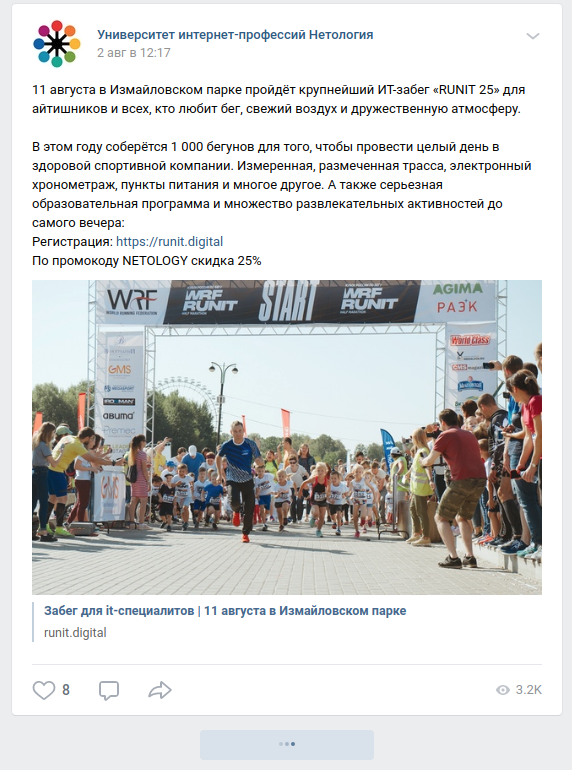

# Redux Saga

---

## [GutHub Pages](https://romanmenshikov92.github.io/ra-16-react-redux-saga/)

Необходимо выполнить и предоставить на проверку следующие задачи:

1. Поиск

# Поиск

Взяв за основу проект, рассмотренный на лекции, доработайте его либо напишите с нуля:

При пустой форме ввода список не отображается, в state он должен быть пустым.
Выводится сообщение: «Type something to search...».

2. Список и детали

# Список и детали

Напишите проект, использующий React Router и Redux Observable, который удовлетворяет следующим условиям:

На главной странице показывается список услуг, редактирование не нужно, достаточно просто ссылок — данные загружаются методом GET на http://localhost:7070/api/services.

При переходе по ссылке (/:id/details), загружаются детали услуги — GET на http://locahost:7070/api/services/:id.

При загрузке должен отображаться индикатор загрузки, что на странице списка, что на странице деталей:

При ошибке должно показываться сообщение об ошибке и кнопка «Повторить запрос», при нажатии на которую осуществляется попытка снова выполнить запрос с индикатором загрузки и т. д.:

Готовый бэкенд расположен в каталоге `backend`.

3. Лента новостей

# Лента новостей

Вам необходимо реализовать некий аналог подгрузки новостей ВКонтакте.

При загрузке страницы грузятся первые пять новостей. На картинке только две, чтобы уместилось:

При нажатии на кнопку «К предыдущим записям» происходит дозагрузка ещё пять:

При возникновении ошибок пользователь не уведомляется, а происходят повторные попытки дозагрузки каждые 3 секунды.

При исчерпании новостей сервер вернёт пустой массив, либо количество элементов в массиве будет меньше пяти, снизу под карточками не отображаются ни кнопки, ни индикатор загрузки:

Для первоначальной загрузки новостей используйте следующий запрос:
GET http://localhost:7070/api/news.

Для загрузки новостей, начиная с определённой, используйте следующий запрос, где X — ID последней загруженной новости:
GET http://localhost:7070/api/news?lastSeenId=X.

Серверная часть расположена в каталоге `backend`.

Убедитесь, что вы правильно парсите реальные данные и максимально точно отображаете вид карточек.

Как минимум должны отображаться:
1. Время в формате день, месяц и часы: минуты.
1. Текст.
1. Количество лайков.
1. Количество комментариев.
1. Количество репостов.
1. Количество просмотров.

Если научитесь отображать ещё и картинки со ссылками — будет супер!

#### Альтернативный способ создания приложения React с использованием тулинга Vite

Приложение также можно создать используя инструмент Vite.
Документация по созданию приложения [React](https://vitejs.dev/guide/).

1. Откройте терминал и пропишите следующую команду: `yarn create vite my-app --template react`,
   либо `yarn create vite my-app --template react-ts`, если
   нужен шаблон с TypeScript. Эта команда создаст настроенный
   шаблонный проект.
2. Откройте созданный проект в своей IDE.
3. Установите зависимости.
4. Готово. Чтобы запустить приложение, введите команду: `yarn dev`(либо `npm run dev`).
